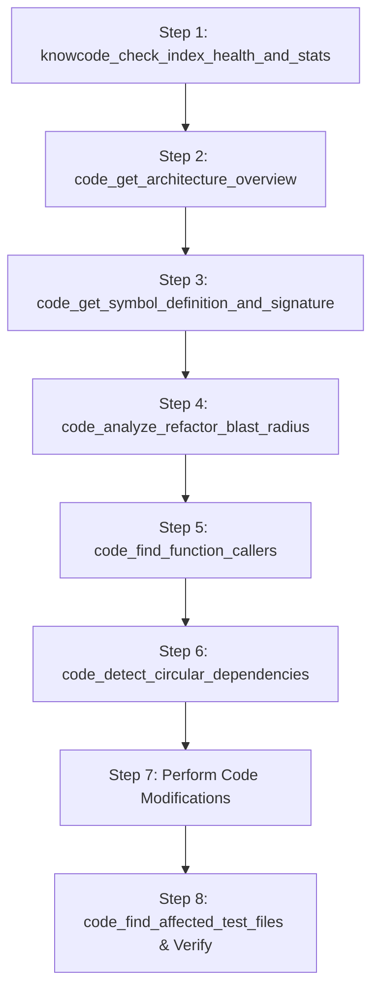

# ⚡ DSH-KnowCode: Unified Code Graph & Knowledge Base for DeepSeek Harness

<p align="center">
  <b>The most powerful codebase navigation, refactoring, and knowledge intelligence plugin for DeepSeek Harness agents.</b><br>
  Combines the best of AST symbol graphs and Markdown knowledge bases into an embedded <b>FalkorDB Cypher graph database</b> with a <code>tgrep</code>-style client-server daemon and incremental file watcher.
</p>

---

## 🌟 Why DSH-KnowCode?

Traditional AI agent search tools rely on naive lexical search (`grep`) or flat SQLite FTS tables that lack semantic graph awareness. When working with **large codebases (>100k LOC, monorepos, multi-package architectures)**, agents often:
- Hallucinate function/method signatures or call arguments.
- Miss transitive ripple effects when renaming or modifying shared symbols (high regression risk).
- Introduce circular dependencies between modules.
- Forget to run or update affected test suites.
- Struggle to port complex modules to another programming language due to hidden dependencies.

**DSH-KnowCode** solves this by unifying:
1. **Code Graph**: AST-parsed symbols (classes, functions, methods, interfaces, types), import trees, call hierarchies, inheritance, and test relationships.
2. **Knowledge Graph**: Architecture Decision Records (ADRs), READMEs, design documents, and coding standards.
3. **Cross-Entity Linking**: Automatic bidirectional edges between documentation and code symbols (`(:DocSection)-[:DOCUMENTS]->(:Symbol)` and `(:Rule)-[:GOVERNS]->(:File)`).
4. **Embedded FalkorDB Engine**: High-performance sparse-matrix GraphBLAS engine executing Cypher queries in sub-milliseconds without Docker or cloud dependencies.
5. **`tgrep`-style Architecture**: One-shot indexer (`knowcode index .`) and a persistent daemon (`knowcode serve`) with a debounced incremental file watcher.

---

## 🚀 Key Highlights & Comparison

| Feature | `dsh-tool-codegraph` | `dsh-knowledge-base` | **`dsh-knowcode`** |
|---|---|---|---|
| **Database** | External C binary | SQLite FTS5 | **Embedded FalkorDB (Cypher Graph)** |
| **Code AST Graph** | ✅ Yes | ❌ No | ✅ **Yes (Multi-language)** |
| **Knowledge / Docs** | ❌ No | ✅ Documents | ✅ **Unified (ADRs + Docs + Rules)** |
| **Cross-Linking** | ❌ No | ❌ No | ✅ **Docs link to Code Symbols** |
| **Refactoring Blast Radius** | Basic depth | ❌ None | ✅ **Transitive risk scoring + test mapping** |
| **Circular Dependency Check** | ❌ No | ❌ No | ✅ **Graph cycle detection (DAG audit)** |
| **Language Porting Contract**| ❌ No | ❌ No | ✅ **API contract & dependency blueprint** |
| **Client-Server Architecture** | CLI subprocess per call | Headless / In-process | ✅ **Microsoft `tgrep`-style daemon + watcher** |
| **Incremental Re-indexing** | Stale sync required | Upsert on import | ✅ **Live debounced file watcher + SHA hashes** |

---

## 🧰 The 25 Agent Tools (v1.4)

Every tool is engineered for **LLM Function Calling and Semantic Intent Matching** on large codebases:

### 🧭 1. Architectural Exploration & Orientation
- **`code_get_architecture_overview`** *(alias: `code_explore`)*
  - *Purpose*: PRIMARY orientation tool. Queries the FalkorDB code graph to return top-level entry points (exported symbols with 0 internal callers), central hub symbols (ranked by incoming call in-degree / PageRank), and language breakdown without flooding the LLM context window with raw code.
  - *When to use*: First step when onboarding a new task or exploring unfamiliar subsystems.

- **`code_get_symbol_definition_and_signature`** *(alias: `code_symbol_definition`)*
  - *Purpose*: Retrieves the exact AST definition, complete type signature, parameter list, return type, docstring, file path, and start/end line numbers of any function, method, class, struct, or interface.
  - *When to use*: Eliminates signature hallucinations and argument guessing during implementation or interface conformance.

### 💥 2. Safe Refactoring & Impact Analysis
- **`code_analyze_refactor_blast_radius`** *(alias: `code_blast_radius`)*
  - *Purpose*: CRITICAL SAFE REFACTORING TOOL. Performs transitive graph traversal up to $N$ hops to discover all indirect callers, computes a quantitative risk assessment score (Low/Medium/High/Critical), identifies all affected files, and lists automated test files covering the affected paths.
  - *When to use*: ALWAYS run before modifying, renaming, or deleting any shared function, class method, or exported API.

- **`code_find_function_callers`** *(alias: `code_callers`, `code_function_callers`)*
  - *Purpose*: Finds all direct invocation sites calling a specific function or class method across the entire codebase. Returns caller names, qualified caller identifiers, file paths, and exact line numbers.
  - *When to use*: Updating every invocation site when modifying function parameters, argument orders, or return types.

- **`code_find_function_callees`** *(alias: `code_callees`, `code_function_callees`)*
  - *Purpose*: Finds all subroutines, helper functions, and methods called directly by a specific function or method (downward execution trace).
  - *When to use*: Inspecting dependencies, sub-calls, and error-checking branches to understand implementation logic and preconditions before modifying a function.

- **`code_detect_circular_dependencies`** *(alias: `code_detect_cycles`)*
  - *Purpose*: Detects circular import or call dependency loops between files, packages, and modules using FalkorDB cycle traversal.
  - *When to use*: Modularizing monolithic codebases, breaking tight coupling, or preparing for language ports (e.g. Go and Rust strictly forbid circular package imports).

- **`code_find_affected_test_files`** *(alias: `code_affected_tests`)*
  - *Purpose*: Discovers all automated unit and integration test files that cover or import the specified source files. Uses both graph import dependencies and naming conventions (*.test.ts, *_test.go, test_*.py).
  - *When to use*: Verifying zero regressions after completing code edits or bug fixes.

- **`code_find_similar_duplicate_functions`** *(alias: `code_find_duplicates`, `code_code_clones`)*
  - *Purpose*: SEMANTIC & STRUCTURAL CODE CLONE HUNTER. Detects duplicate or near-duplicate functions across the codebase (Type-1 exact clones and Type-2 variable-renamed clones) using normalized AST token stream fingerprinting. Uncovers copy-pasted "dirty code" where logic and control flow are identical but variable names differ, proposing unified abstractions to eliminate technical debt.
  - *When to use*: Codebase deduplication, technical debt cleanup, and refactoring shared subroutines.

### 🔄 3. Cross-Language & Paradigm Porting (v1.2)
- **`code_extract_symbol_porting_contract`** *(alias: `code_porting_contract`)*
  - *Purpose*: CROSS-LANGUAGE PORTING ACCELERATOR. Extracts the complete language-agnostic interface blueprint of a class, struct, or module: exported signatures, member fields, enclosed methods, external callee dependencies, governing ADR architectural rules, and test suites.
  - *When to use*: Porting code from one language to another (e.g., Python to Go, TypeScript to Rust) with 100% semantic fidelity.

- **`code_generate_cross_paradigm_porting_blueprint`** *(alias: `code_oop_to_rust`, `code_port_to_rust`)*
  - *Purpose*: OOP-TO-RUST/GO SPECIALIZED ACCELERATOR. Flattens complex OOP class inheritance hierarchies into traits and structs, transforms runtime exceptions (`throws Exception`) into idiomatic algebraic `Result<T, ErrorEnum>` types, and provides explicit borrow checker ownership guidelines (avoiding circular `Rc/RefCell` pitfalls).
  - *When to use*: Porting Java/C#/C++ object-oriented modules to Rust or Go.

- **`code_extract_third_party_usage_slice`** *(alias: `code_library_slice`, `code_slim_polyfill`)*
  - *Purpose*: ZERO-DEPENDENCY SLIM POLYFILL ACCELERATOR. Identifies the exact subset of a 3rd-party library actually invoked by the codebase. Eliminates the 95% unused library surface and outputs a minimal functional specification and method contract so an AI Agent or developer can re-implement the necessary features from scratch in the target language without bloated external dependencies.
  - *When to use*: Migrating code when the target language lacks an equivalent 3rd-party library.

### 📚 4. Bidirectional Spec 🔁 Code Traceability & Knowledge (v1.3)
- **`spec_find_code_flow_for_feature`** *(alias: `spec_to_code_flow`, `feature_code_flow`, `code_feature_flow`)*
  - *Purpose*: BIDIRECTIONAL TRACEABILITY (Spec ➔ Code Flow). Discovers all functions, classes, and downstream call-flows in the codebase that implement a feature specified in `*.md` documentation, PRD, or architecture specs. Traverses execution flow from entry points to leaf services and generates an ASCII / Mermaid execution diagram.
  - *When to use*: Onboarding a feature, verifying whether a specification in `*.md` has been fully implemented in code, or locating the entire execution path of a user story.

- **`code_find_spec_features_for_symbol`** *(alias: `code_to_spec_features`, `symbol_feature_specs`, `feature_for_symbol`)*
  - *Purpose*: BIDIRECTIONAL TRACEABILITY (Code ➔ Feature Specs). Identifies all features, specifications in `*.md`, PRD sections, and architectural rules that a specific function, method, or class belongs to or serves. Traces both direct documentation links and upstream caller execution paths.
  - *When to use*: Answering "Why does this function exist? What business features or specs depend on this class?" before refactoring or removing a piece of code.

- **`knowledge_search_documentation_and_rules`** *(alias: `knowledge_search`)*
  - *Purpose*: Searches across project documentation, Architecture Decision Records (ADRs), specifications, and coding standards. Returns matched sections with priority levels (MUST / SHOULD / AVOID) and automatic cross-links to related code symbols in the graph.
  - *When to use*: Checking existing architectural patterns or requirements before introducing new abstractions.

- **`knowledge_get_document_content_and_rules`** *(alias: `knowledge_doc`)*
  - *Purpose*: Retrieves the full content, heading hierarchy, and architectural rules for a specific documentation file or ADR title.
  - *When to use*: Understanding why an architectural decision was made (the "Why") before refactoring existing code patterns.

### 🗄️ 5. Polyglot Contracts & Storage Traceability (v1.4)
- **`schema_map_contract_to_storage`** *(alias: `schema_map_contract`, `contract_to_db`, `map_contract_to_storage`)*
  - *Purpose*: POLYGLOT CONTRACT-TO-STORAGE ALIGNMENT. Maps any external data contract (XML XSD, JSON OpenAPI/Swagger, gRPC Protobuf) to polyglot storage backends across 7 database families (SQL, MongoDB, Redis, Elasticsearch, Vector DB, TSDB, Graph DB). Produces a field-level mapping matrix, detects type discrepancies (e.g. numeric overflow, BSON ObjectId vs UUID, dense vector dimensions), and flags unmapped/orphan attributes.
  - *When to use*: Verifying end-to-end data lineage from API contracts to storage, discovering unpersisted fields, or validating type safety across microservice boundaries.

- **`schema_analyze_storage_migration_impact`** *(alias: `schema_migration_impact`, `db_migration_blast_radius`)*
  - *Purpose*: POLYGLOT STORAGE MIGRATION BLAST RADIUS. Analyzes the breaking impact of altering, dropping, or renaming an attribute in SQL tables, MongoDB collections, Elasticsearch indices, or Vector DB collections. Detects all affected external contracts (XML/JSON/gRPC), application DAOs/queries, and mapped test suites.
  - *When to use*: Running schema migrations, database refactorings, or dropping columns to prevent breaking mobile/web clients or partner integrations.

### 🔍 6. Advanced Call Path, Architecture & Search (v1.1)
- **`code_find_call_path_between_symbols`** *(alias: `code_call_path`, `code_trace_call_path`)*
  - *Purpose*: Traces the shortest call invocation path between two functions or methods across the entire codebase graph (up to 12 hops). Traces multi-hop execution flow from entry points to downstream services, helping verify architectural layering, security boundaries, and dataflow paths.
  - *When to use*: Verifying if an API route reaches a critical downstream function (e.g. `chargePayment` or `deleteUser`) and observing all intermediate transit points.

- **`code_find_implementations_and_subtypes`** *(alias: `code_subtypes`, `code_implementations`)*
  - *Purpose*: Finds all subclasses, structs, and classes that extend or implement a given interface, abstract class, or base class.
  - *When to use*: Exploring polymorphism, implementing dependency injection bindings, or writing mock implementations for unit testing.

- **`code_search_symbols_by_pattern`** *(alias: `code_search_symbols`)*
  - *Purpose*: Searches for symbols across the codebase by name pattern, case-insensitive substring, or keyword.
  - *When to use*: Discovering exact qualified symbol names when you only recall partial keywords (e.g. "Token", "Auth", "Payment").

- **`code_find_unused_dead_symbols`** *(alias: `code_dead_code`, `code_unused_symbols`)*
  - *Purpose*: Identifies unreferenced internal/private symbols with 0 incoming calls in the codebase graph.
  - *When to use*: Performing technical debt cleanups and safely pruning obsolete dead code.

- **`code_analyze_git_diff_semantic_impact`** *(alias: `code_git_diff_impact`, `code_audit_git_diff`)*
  - *Purpose*: ONE-CLICK REGRESSION AUDIT. Analyzes uncommitted git working tree changes (or changes against a base commit/branch), maps changed line ranges to AST symbols, computes transitive callers at risk, and identifies all automated test suites to run before commit or PR creation.
  - *When to use*: Pre-commit safety check to verify zero regressions before concluding a coding task.

### ⚡ 6. Diagnostics & Power Queries
- **`knowcode_check_index_health_and_stats`** *(alias: `knowcode_status`)*
  - *Purpose*: Checks graph health, number of indexed files/symbols/calls/docs, daemon freshness, and memory statistics.
  - *When to use*: Run once per session to confirm index freshness.

- **`knowcode_trigger_incremental_reindex`** *(alias: `knowcode_sync`)*
  - *Purpose*: Triggers an on-demand incremental re-index of any modified or newly added files across the workspace.
  - *When to use*: After large batch edits to synchronize the graph with disk.

- **`knowcode_execute_custom_cypher_query`** *(alias: `knowcode_cypher`)*
  - *Purpose*: Direct Cypher query escape hatch against FalkorDB.
  - *When to use*: Advanced multi-hop graph queries (e.g., finding classes implementing interface X that do not call method Y).

---

## 🛠 CLI Usage (Microsoft `tgrep`-style)

`dsh-knowcode` ships with the `knowcode` executable CLI for terminal usage and CI/CD pipelines:

### 1. One-shot Indexing (`knowcode index`)
Index a codebase and its documentation into the embedded FalkorDB database:
```bash
# Index current directory
knowcode index .

# Index specific directory with custom data directory
knowcode index ./my-repo --data-dir .knowcode
```

### 2. Background Daemon with Live Watcher (`knowcode serve`)
Starts the server daemon, loads embedded FalkorDB, watches the workspace for changes, and incrementally re-indexes files in real time:
```bash
knowcode serve .
```
- Listens on `http://127.0.0.1:48123`.
- File modifications trigger debounced SHA-256 diffing and instant incremental graph updates.
- DeepSeek Harness tools connect over HTTP/IPC for **<2ms response times**.

### 3. Check Status (`knowcode status`)
```bash
knowcode status .
```
Output:
```
========================================
        KnowCode Graph & Knowledge      
========================================
Status:          ONLINE (PID: 66088, Port: 48123)
Database:        /Users/kean/Projects/my-project/.knowcode
Total Files:     148
Total Symbols:   1,240
Total Calls:     3,892
Total Docs:      18 (64 sections, 22 rules)
Last Indexed:    2026-09-16T10:19:43.240Z
Languages:
  - typescript: 120 files
  - python: 28 files
========================================
```

### 4. Execute Direct Cypher Queries (`knowcode query`)
```bash
knowcode query "MATCH (s:Symbol {kind: 'class'}) RETURN s.name, s.file"
```

### 5. Stop Daemon (`knowcode stop`)
```bash
knowcode stop .
```

---

## 💻 Platform Support & Execution Guide (Hướng dẫn Chạy theo Nền tảng)

`dsh-knowcode` được thiết kế để hoạt động mượt mà trên tất cả các hệ điều hành và kiến trúc chip:

> ### ⚠️ Bắt buộc: Cài đặt Git LFS trước khi clone
> Các binary FalkorDB embedded (`*.so`, `*.dylib`, `redis-server`) được lưu trữ bằng **Git LFS** để tránh phình lịch sử git.
> Nếu bạn clone mà **chưa cài Git LFS**, các file này sẽ chỉ là *pointer file* dạng text (~130 bytes) và database sẽ không khởi động được.
> ```bash
> # macOS
> brew install git-lfs
> # Ubuntu / Debian / WSL2
> sudo apt-get install -y git-lfs
> # Windows (PowerShell)
> winget install GitHub.GitLFS
>
> git lfs install        # bắt buộc chạy 1 lần cho mỗi máy
> git clone git@github.com:huuthuan-nguyen/dsh-knowcode.git
> ```
> **Đã clone rồi mà thiếu binary?** Chỉ cần tải lại:
> ```bash
> git lfs install && git lfs pull
> ```
> Kiểm tra nhanh: `file bin/linux-x64/falkordb.so` phải trả về `ELF 64-bit ... shared object`,
> nếu trả về `ASCII text` nghĩa là LFS chưa được pull.

| Nền tảng (Platform & Arch) | Trạng thái trong `bin/` | Cơ chế Chạy | Chi tiết Cài đặt |
|---|:---:|---|---|
| 🍏 **macOS Apple Silicon** (`darwin-arm64` M1/M2/M3/M4) | ✅ **Bundled sẵn** | **Native 100% Embedded** | Không cần cài đặt gì thêm (Zero-config). Đã kèm `redis-server`, `falkordb.so`, `libomp`. |
| 🐧 **Linux x64** (`linux-x64` Intel/AMD 64-bit) | ✅ **Bundled sẵn** | **Native 100% Embedded** | Không cần cài đặt gì thêm (Zero-config). Đã kèm `redis-server` và `falkordb.so`. |
| 🐧 **Linux ARM64** (`linux-arm64` Graviton, Pi 4/5) | 🔄 **Docker / External** | **Docker hoặc Custom Binary** | Khởi động qua Docker hoặc đặt binary vào `bin/linux-arm64/`. |
| 🪟 **Windows x64** (Intel/AMD) | ⚠️ **Cần WSL2 hoặc Docker** | **WSL2 (Khuyên dùng) hoặc Docker** | Chạy trong WSL2 Ubuntu hoặc Docker Desktop. |
| 🪟 **Windows ARM64** (Snapdragon Copilot+ PC) | ⚠️ **Cần WSL2 hoặc Docker** | **WSL2 ARM64 hoặc Docker** | Chạy trong WSL2 Ubuntu ARM64 hoặc Docker Desktop. |

---

### 1. Chạy trên macOS (M1/M2/M3/M4) & Linux x64
Hệ thống **hoàn toàn tự động (Zero-config)**:
```bash
# Build và chạy trực tiếp
pnpm run build
pnpm run test

# Index workspace
knowcode index .

# Khởi động daemon nền
knowcode serve .
```

---

### 2. Chạy trên Linux ARM64 (AWS Graviton, Raspberry Pi 4/5)
FalkorDB cung cấp image đa kiến trúc chính thức (`linux/arm64`):
- **Cách 1: Khởi động qua Docker (Nhanh nhất)**:
  ```bash
  docker run -d -p 6379:6379 -v knowcode_data:/data falkordb/falkordb:latest
  export FALKORDB_URL=redis://127.0.0.1:6379
  knowcode serve .
  ```
- **Cách 2: Sử dụng Embedded Binary**:
  Biên dịch hoặc copy `redis-server` và `falkordb.so` kiến trúc ARM64 vào `bin/linux-arm64/`. Hệ thống sẽ tự động phát hiện và chạy embedded mà không cần Docker.

---

### 3. Chạy trên Windows (Windows x64 & Windows ARM64 Snapdragon)

> **Lưu ý Kỹ thuật**: FalkorDB là Redis Module viết bằng C/Rust và GraphBLAS dựa trên chuẩn POSIX (`pthreads`, `dlopen`, `sys/mman`). Bản thân Redis chính thức đã dừng port native Windows (`.exe`) từ Redis 3.x, trong khi FalkorDB yêu cầu Redis 7.2+ Module API. Do đó, FalkorDB không có file `.exe` chạy trực tiếp trên Windows kernel.

Để chạy mượt mà nhất trên Windows, bạn chọn 1 trong 2 cách sau:

#### 🌟 Cách 1: Chạy trong WSL2 (Windows Subsystem for Linux) — *Khuyên dùng*
WSL2 cung cấp nhân Linux thực sự bên trong Windows, cho phép tận dụng 100% hiệu năng của binary Linux embedded:
```bash
# Trong terminal Ubuntu của WSL2:
git clone <your-repo>
cd dsh-knowcode
pnpm install
pnpm run build

# Chạy trực tiếp (sử dụng binary bin/linux-x64 hoặc bin/linux-arm64):
knowcode index .
knowcode serve .
```

#### 🐳 Cách 2: Chạy qua Docker Desktop for Windows
Nếu muốn chạy trực tiếp trên Windows PowerShell/CMD mà không dùng WSL2 cho Node:
1. Mở PowerShell và khởi động container FalkorDB:
   ```powershell
   docker run -d -p 6379:6379 -v knowcode_data:/data falkordb/falkordb:latest
   ```
2. Đặt biến môi trường trỏ đến container:
   ```powershell
   $env:FALKORDB_URL="redis://127.0.0.1:6379"
   ```
3. Khởi động KnowCode hoặc DeepSeek Harness:
   ```powershell
   knowcode index .
   knowcode serve .
   ```
   Hệ thống sẽ tự động nhận diện `FALKORDB_URL` và kết nối trực tiếp qua loopback TCP mà không cần nạp binary cục bộ.

---

## 🔌 DeepSeek Harness Plugin Setup

### Method 1: Via Cordis Bundle Patch (Recommended)

In your profile's `cordis.patch.yml`:
```yaml
- insert:
    - id: knowcode
      name: 'dsh-knowcode'
      config:
        daemonPort: 48123
        dataDir: .knowcode
        blastRadiusMaxDepth: 3
```

### Method 2: Via DSH CLI
```bash
dsh plugin add --profile web dsh-knowcode
```

---

## 🏗 Safe Refactoring Protocol for Agents

The plugin automatically injects the **KnowCode Safe Refactoring Protocol** into the agent's system prompt:



---

## 🧪 Testing & Verification

Run the full test suite (built-in Node test runner):
```bash
pnpm run build
pnpm run test
```
Runs:
- Multi-language AST parsing (TypeScript, Python, Go, Rust, C++)
- Document parsing, rule extraction, and symbol cross-linking
- Embedded FalkorDB startup, Cypher schema, and graph queries
- Daemon HTTP/JSON RPC server and debounced file watcher
- Cordis plugin registration and system prompt injection

---

## 📄 License

MIT © [dsh-knowcode contributors](LICENSE)
