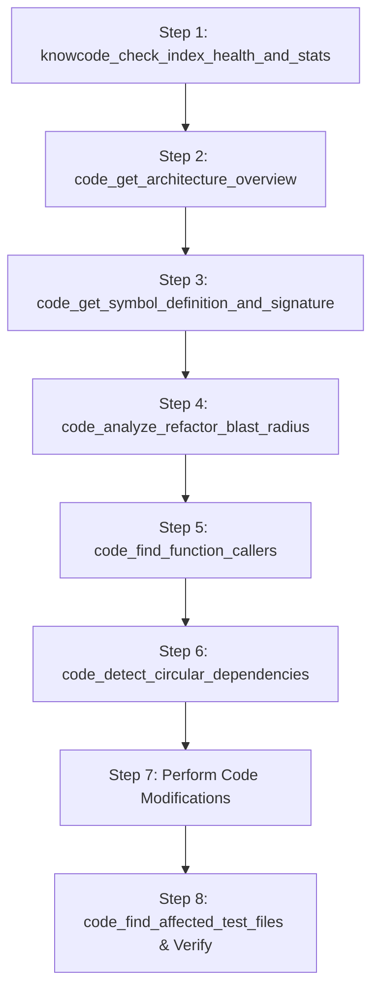

# ⚡ DSH-KnowCode: Unified Code Graph & Knowledge Base for DeepSeek Harness

[](https://github.com/huuthuan-nguyen/dsh-knowcode/releases)
[](https://opensource.org/licenses/MIT)
[](https://github.com/deepseek-ai/deepseek-harness)
[](https://github.com/topics/dsh-plugin)

<p align="center">
  <b>The most powerful codebase navigation, refactoring, and knowledge intelligence plugin for DeepSeek Harness agents.</b><br>
  Combines the best of AST symbol graphs and Markdown knowledge bases into an embedded <b>FalkorDB Cypher graph database</b> with a <code>tgrep</code>-style client-server daemon and incremental file watcher.
</p>

---

## 🌟 Why DSH-KnowCode?

Traditional AI agent search tools rely on naive lexical search (`grep`) or flat SQLite FTS tables that lack semantic graph awareness. When working with **large codebases (>100k LOC, monorepos, multi-package architectures)**, agents often:
- Hallucinate function/method signatures or call arguments.
- Miss transitive ripple effects when renaming or modifying shared symbols (high regression risk).
- Introduce circular dependencies between modules.
- Forget to run or update affected test suites.
- Struggle to port complex modules to another programming language due to hidden dependencies.

**DSH-KnowCode** solves this by unifying:
1. **Code Graph**: AST-parsed symbols (classes, functions, methods, interfaces, types), import trees, call hierarchies, inheritance, and test relationships.
2. **Knowledge Graph**: Architecture Decision Records (ADRs), READMEs, design documents, and coding standards.
3. **Cross-Entity Linking**: Automatic bidirectional edges between documentation and code symbols (`(:DocSection)-[:DOCUMENTS]->(:Symbol)` and `(:Rule)-[:GOVERNS]->(:File)`).
4. **Embedded FalkorDB Engine**: High-performance sparse-matrix GraphBLAS engine executing Cypher queries in sub-milliseconds without Docker or cloud dependencies.
5. **`tgrep`-style Architecture**: One-shot indexer (`knowcode index .`) and a persistent daemon (`knowcode serve`) with a debounced incremental file watcher.

---

## 🚀 Key Highlights & Comparison

| Feature | `dsh-tool-codegraph` | `dsh-knowledge-base` | **`dsh-knowcode`** |
|---|---|---|---|
| **Database** | External C binary | SQLite FTS5 | **Embedded FalkorDB (Cypher Graph)** |
| **Code AST Graph** | ✅ Yes | ❌ No | ✅ **Yes (Multi-language)** |
| **Knowledge / Docs** | ❌ No | ✅ Documents | ✅ **Unified (ADRs + Docs + Rules)** |
| **Cross-Linking** | ❌ No | ❌ No | ✅ **Docs link to Code Symbols** |
| **Refactoring Blast Radius** | Basic depth | ❌ None | ✅ **Transitive risk scoring + test mapping** |
| **Circular Dependency Check** | ❌ No | ❌ No | ✅ **Graph cycle detection (DAG audit)** |
| **Language Porting Contract**| ❌ No | ❌ No | ✅ **API contract & dependency blueprint** |
| **Client-Server Architecture** | CLI subprocess per call | Headless / In-process | ✅ **Microsoft `tgrep`-style daemon + watcher** |
| **Incremental Re-indexing** | Stale sync required | Upsert on import | ✅ **Live debounced file watcher + SHA hashes** |

---

## 📦 Installation & Quickstart

### Prerequisites

| Requirement | Notes |
|---|---|
| **Node.js** `^22.19.0 \|\| >=24.0.0` | Same range the DeepSeek Harness requires. |
| **pnpm** | Used by the development workflow (`pnpm run build`, `pnpm run test`). |
| **Git LFS** | Needed to fetch the embedded FalkorDB binaries when cloning — see *Platform Support & Execution Guide* below. |

### Where does the `knowcode` command come from?

There is **no separate binary to download**. `knowcode` is the CLI entry point shipped inside this package and declared in its `package.json`:

```json
"bin": { "knowcode": "./bin/knowcode.js" }
```

Whenever the package is installed or linked, npm/pnpm expose that file as a `knowcode` symlink inside `node_modules/.bin/`. The file itself is a plain Node.js script (`#!/usr/bin/env node`), so it runs anywhere the runtime dependencies are installed.

Pick whichever option below fits your situation.

### Option 1 — Run from a clone (no install step)

```bash
git clone git@github.com:huuthuan-nguyen/dsh-knowcode.git
cd dsh-knowcode
pnpm install            # runtime deps: commander, falkordb, chokidar, fast-glob, ignore
./bin/knowcode.js index .
```

`node bin/knowcode.js index .` behaves identically if you prefer to be explicit. The compiled `lib/` directory is committed, so no build is required.

> **After editing anything under `src/`, rebuild before using the CLI** — `bin/knowcode.js` and the whole CLI import from `../lib/`:
> ```bash
> pnpm run build
> ```

### Option 2 — `npm link` for a global `knowcode` command

Best for local development, so `knowcode` works from any directory:

```bash
cd dsh-knowcode
pnpm install && pnpm run build
npm link
knowcode index .
```

`npm link` reads the `bin` field and symlinks `knowcode` into the global bin directory (shown by `npm prefix -g`). To undo it:

```bash
npm unlink -g dsh-knowcode
```

### Option 3 — Install into a DeepSeek Harness profile

This links the package into `~/.dsh/profiles/<profile>/node_modules/` and registers it with the harness in one step:

```bash
dsh plugin add --profile web dsh-knowcode
```

The CLI becomes available inside that profile as well:

```bash
~/.dsh/profiles/web/node_modules/.bin/knowcode index .
```

Prefer configuring the profile by hand? Use the bundle patch shown under **DeepSeek Harness Plugin Setup** below, then restart the harness.

### Option 4 — Install from npm (once published)

> ⚠️ **Not published yet** — `npm view dsh-knowcode` currently returns `404`. These commands apply after the first `npm publish`.

```bash
# Global CLI
npm install -g dsh-knowcode
knowcode index .

# …or as a project dependency
pnpm add dsh-knowcode
pnpm exec knowcode index .
```

### Verify the installation

```bash
knowcode --version     # prints the package version
knowcode --help        # lists: index, serve, status, query, stop
```

Then build a graph for your repository and start the daemon:

```bash
knowcode index .                # one-shot index of code + docs
knowcode serve .                # background daemon + live file watcher
knowcode serve . --trace        # …with tgrep-style [trace] diagnostics
knowcode status .               # health, file counts and daemon state
```

See the **CLI Usage** section below for the full command reference, and **Platform Support & Execution Guide** for per-operating-system notes (including Windows/WSL2 and Linux ARM64).

---

## 🧰 The 25 Agent Tools

Every tool is engineered for **LLM Function Calling and Semantic Intent Matching** on large codebases:

### 🧭 1. Architectural Exploration & Orientation
- **`code_get_architecture_overview`** *(alias: `code_explore`)*
  - *Purpose*: PRIMARY orientation tool. Queries the FalkorDB code graph to return top-level entry points (exported symbols with 0 internal callers), central hub symbols (ranked by incoming call in-degree / PageRank), and language breakdown without flooding the LLM context window with raw code.
  - *When to use*: First step when onboarding a new task or exploring unfamiliar subsystems.

- **`code_get_symbol_definition_and_signature`** *(alias: `code_symbol_definition`)*
  - *Purpose*: Retrieves the exact AST definition, complete type signature, parameter list, return type, docstring, file path, and start/end line numbers of any function, method, class, struct, or interface.
  - *When to use*: Eliminates signature hallucinations and argument guessing during implementation or interface conformance.

### 💥 2. Safe Refactoring & Impact Analysis
- **`code_analyze_refactor_blast_radius`** *(alias: `code_blast_radius`)*
  - *Purpose*: CRITICAL SAFE REFACTORING TOOL. Performs transitive graph traversal up to $N$ hops to discover all indirect callers, computes a quantitative risk assessment score (Low/Medium/High/Critical), identifies all affected files, and lists automated test files covering the affected paths.
  - *When to use*: ALWAYS run before modifying, renaming, or deleting any shared function, class method, or exported API.

- **`code_find_function_callers`** *(alias: `code_callers`, `code_function_callers`)*
  - *Purpose*: Finds all direct invocation sites calling a specific function or class method across the entire codebase. Returns caller names, qualified caller identifiers, file paths, and exact line numbers.
  - *When to use*: Updating every invocation site when modifying function parameters, argument orders, or return types.

- **`code_find_function_callees`** *(alias: `code_callees`, `code_function_callees`)*
  - *Purpose*: Finds all subroutines, helper functions, and methods called directly by a specific function or method (downward execution trace).
  - *When to use*: Inspecting dependencies, sub-calls, and error-checking branches to understand implementation logic and preconditions before modifying a function.

- **`code_detect_circular_dependencies`** *(alias: `code_detect_cycles`)*
  - *Purpose*: Detects circular import or call dependency loops between files, packages, and modules using FalkorDB cycle traversal.
  - *When to use*: Modularizing monolithic codebases, breaking tight coupling, or preparing for language ports (e.g. Go and Rust strictly forbid circular package imports).

- **`code_find_affected_test_files`** *(alias: `code_affected_tests`)*
  - *Purpose*: Discovers all automated unit and integration test files that cover or import the specified source files. Uses both graph import dependencies and naming conventions (*.test.ts, *_test.go, test_*.py).
  - *When to use*: Verifying zero regressions after completing code edits or bug fixes.

- **`code_find_similar_duplicate_functions`** *(alias: `code_find_duplicates`, `code_code_clones`)*
  - *Purpose*: SEMANTIC & STRUCTURAL CODE CLONE HUNTER. Detects duplicate or near-duplicate functions across the codebase (Type-1 exact clones and Type-2 variable-renamed clones) using normalized AST token stream fingerprinting. Uncovers copy-pasted "dirty code" where logic and control flow are identical but variable names differ, proposing unified abstractions to eliminate technical debt.
  - *When to use*: Codebase deduplication, technical debt cleanup, and refactoring shared subroutines.

### 🔄 3. Cross-Language & Paradigm Porting
- **`code_extract_symbol_porting_contract`** *(alias: `code_porting_contract`)*
  - *Purpose*: CROSS-LANGUAGE PORTING ACCELERATOR. Extracts the complete language-agnostic interface blueprint of a class, struct, or module: exported signatures, member fields, enclosed methods, external callee dependencies, governing ADR architectural rules, and test suites.
  - *When to use*: Porting code from one language to another (e.g., Python to Go, TypeScript to Rust) with 100% semantic fidelity.

- **`code_generate_cross_paradigm_porting_blueprint`** *(alias: `code_oop_to_rust`, `code_port_to_rust`)*
  - *Purpose*: OOP-TO-RUST/GO SPECIALIZED ACCELERATOR. Flattens complex OOP class inheritance hierarchies into traits and structs, transforms runtime exceptions (`throws Exception`) into idiomatic algebraic `Result<T, ErrorEnum>` types, and provides explicit borrow checker ownership guidelines (avoiding circular `Rc/RefCell` pitfalls).
  - *When to use*: Porting Java/C#/C++ object-oriented modules to Rust or Go.

- **`code_extract_third_party_usage_slice`** *(alias: `code_library_slice`, `code_slim_polyfill`)*
  - *Purpose*: ZERO-DEPENDENCY SLIM POLYFILL ACCELERATOR. Identifies the exact subset of a 3rd-party library actually invoked by the codebase. Eliminates the 95% unused library surface and outputs a minimal functional specification and method contract so an AI Agent or developer can re-implement the necessary features from scratch in the target language without bloated external dependencies.
  - *When to use*: Migrating code when the target language lacks an equivalent 3rd-party library.

### 📚 4. Bidirectional Spec 🔁 Code Traceability & Knowledge
- **`spec_find_code_flow_for_feature`** *(alias: `spec_to_code_flow`, `feature_code_flow`, `code_feature_flow`)*
  - *Purpose*: BIDIRECTIONAL TRACEABILITY (Spec ➔ Code Flow). Discovers all functions, classes, and downstream call-flows in the codebase that implement a feature specified in `*.md` documentation, PRD, or architecture specs. Traverses execution flow from entry points to leaf services and generates an ASCII / Mermaid execution diagram.
  - *When to use*: Onboarding a feature, verifying whether a specification in `*.md` has been fully implemented in code, or locating the entire execution path of a user story.

- **`code_find_spec_features_for_symbol`** *(alias: `code_to_spec_features`, `symbol_feature_specs`, `feature_for_symbol`)*
  - *Purpose*: BIDIRECTIONAL TRACEABILITY (Code ➔ Feature Specs). Identifies all features, specifications in `*.md`, PRD sections, and architectural rules that a specific function, method, or class belongs to or serves. Traces both direct documentation links and upstream caller execution paths.
  - *When to use*: Answering "Why does this function exist? What business features or specs depend on this class?" before refactoring or removing a piece of code.

- **`knowledge_search_documentation_and_rules`** *(alias: `knowledge_search`)*
  - *Purpose*: Searches across project documentation, Architecture Decision Records (ADRs), specifications, and coding standards. Returns matched sections with priority levels (MUST / SHOULD / AVOID) and automatic cross-links to related code symbols in the graph.
  - *When to use*: Checking existing architectural patterns or requirements before introducing new abstractions.

- **`knowledge_get_document_content_and_rules`** *(alias: `knowledge_doc`)*
  - *Purpose*: Retrieves the full content, heading hierarchy, and architectural rules for a specific documentation file or ADR title.
  - *When to use*: Understanding why an architectural decision was made (the "Why") before refactoring existing code patterns.

### 🗄️ 5. Polyglot Contracts & Storage Traceability
- **`schema_map_contract_to_storage`** *(alias: `schema_map_contract`, `contract_to_db`, `map_contract_to_storage`)*
  - *Purpose*: POLYGLOT CONTRACT-TO-STORAGE ALIGNMENT. Maps any external data contract (XML XSD, JSON OpenAPI/Swagger, gRPC Protobuf) to polyglot storage backends across 7 database families (SQL, MongoDB, Redis, Elasticsearch, Vector DB, TSDB, Graph DB). Produces a field-level mapping matrix, detects type discrepancies (e.g. numeric overflow, BSON ObjectId vs UUID, dense vector dimensions), and flags unmapped/orphan attributes.
  - *When to use*: Verifying end-to-end data lineage from API contracts to storage, discovering unpersisted fields, or validating type safety across microservice boundaries.

- **`schema_analyze_storage_migration_impact`** *(alias: `schema_migration_impact`, `db_migration_blast_radius`)*
  - *Purpose*: POLYGLOT STORAGE MIGRATION BLAST RADIUS. Analyzes the breaking impact of altering, dropping, or renaming an attribute in SQL tables, MongoDB collections, Elasticsearch indices, or Vector DB collections. Detects all affected external contracts (XML/JSON/gRPC), application DAOs/queries, and mapped test suites.
  - *When to use*: Running schema migrations, database refactorings, or dropping columns to prevent breaking mobile/web clients or partner integrations.

### 🔍 6. Advanced Call Path, Architecture & Search
- **`code_find_call_path_between_symbols`** *(alias: `code_call_path`, `code_trace_call_path`)*
  - *Purpose*: Traces the shortest call invocation path between two functions or methods across the entire codebase graph (up to 12 hops). Traces multi-hop execution flow from entry points to downstream services, helping verify architectural layering, security boundaries, and dataflow paths.
  - *When to use*: Verifying if an API route reaches a critical downstream function (e.g. `chargePayment` or `deleteUser`) and observing all intermediate transit points.

- **`code_find_implementations_and_subtypes`** *(alias: `code_subtypes`, `code_implementations`)*
  - *Purpose*: Finds all subclasses, structs, and classes that extend or implement a given interface, abstract class, or base class.
  - *When to use*: Exploring polymorphism, implementing dependency injection bindings, or writing mock implementations for unit testing.

- **`code_search_symbols_by_pattern`** *(alias: `code_search_symbols`)*
  - *Purpose*: Searches for symbols across the codebase by name pattern, case-insensitive substring, or keyword.
  - *When to use*: Discovering exact qualified symbol names when you only recall partial keywords (e.g. "Token", "Auth", "Payment").

- **`code_find_unused_dead_symbols`** *(alias: `code_dead_code`, `code_unused_symbols`)*
  - *Purpose*: Identifies unreferenced internal/private symbols with 0 incoming calls in the codebase graph.
  - *When to use*: Performing technical debt cleanups and safely pruning obsolete dead code.

- **`code_analyze_git_diff_semantic_impact`** *(alias: `code_git_diff_impact`, `code_audit_git_diff`)*
  - *Purpose*: ONE-CLICK REGRESSION AUDIT. Analyzes uncommitted git working tree changes (or changes against a base commit/branch), maps changed line ranges to AST symbols, computes transitive callers at risk, and identifies all automated test suites to run before commit or PR creation.
  - *When to use*: Pre-commit safety check to verify zero regressions before concluding a coding task.

### ⚡ 7. Diagnostics & Power Queries
- **`knowcode_check_index_health_and_stats`** *(alias: `knowcode_status`)*
  - *Purpose*: Checks graph health, number of indexed files/symbols/calls/docs, daemon freshness, and memory statistics.
  - *When to use*: Run once per session to confirm index freshness.

- **`knowcode_trigger_incremental_reindex`** *(alias: `knowcode_sync`)*
  - *Purpose*: Triggers an on-demand incremental re-index of any modified or newly added files across the workspace.
  - *When to use*: After large batch edits to synchronize the graph with disk.

- **`knowcode_execute_custom_cypher_query`** *(alias: `knowcode_cypher`)*
  - *Purpose*: Direct Cypher query escape hatch against FalkorDB.
  - *When to use*: Advanced multi-hop graph queries (e.g., finding classes implementing interface X that do not call method Y).

---

## 🛠 CLI Usage (Microsoft `tgrep`-style)

`dsh-knowcode` ships with the `knowcode` executable CLI for terminal usage and CI/CD pipelines.

> **Not sure you have the `knowcode` command yet?** It is not a separate download — see **Installation & Quickstart** above for the four ways to obtain it. Quick check: `knowcode --version`.
>
> Throughout this section, `knowcode …` can always be replaced by `./bin/knowcode.js …` when running from a clone.

### 1. One-shot Indexing (`knowcode index`)
Index a codebase and its documentation into the embedded FalkorDB database:
```bash
# Index current directory
knowcode index .

# Index specific directory with custom data directory
knowcode index ./my-repo --data-dir .knowcode
```

### 2. Background Daemon with Live Watcher (`knowcode serve`)
Starts the server daemon, loads embedded FalkorDB, watches the workspace for changes, and incrementally re-indexes files in real time:
```bash
knowcode serve .
```
- Listens on `http://127.0.0.1:48123`.
- File modifications trigger debounced SHA-256 diffing and instant incremental graph updates.
- DeepSeek Harness tools connect over HTTP/IPC for **<2ms response times**.

### 3. Check Status (`knowcode status`)
```bash
knowcode status .
```
Output:
```
========================================
        KnowCode Graph & Knowledge      
========================================
Status:          ONLINE (PID: 66088, Port: 48123)
Database:        /Users/kean/Projects/my-project/.knowcode
Total Files:     148
Total Symbols:   1,240
Total Calls:     3,892
Total Docs:      18 (64 sections, 22 rules)
Last Indexed:    2026-09-16T10:19:43.240Z
Languages:
  - typescript: 120 files
  - python: 28 files
========================================
```

### 4. Execute Direct Cypher Queries (`knowcode query`)
```bash
knowcode query "MATCH (s:Symbol {kind: 'class'}) RETURN s.name, s.file"
```

### 5. Stop Daemon (`knowcode stop`)
```bash
knowcode stop .
```

### 6. Trace Logging (`--trace`)

`serve` and `index` accept a `-t, --trace` flag that emits **Microsoft `tgrep`-style** `[trace]` diagnostics: one line per phase and per request, with timings, candidate/match counts, and watcher activity.

```bash
knowcode serve . --trace          # trace this run
knowcode index . --trace          # trace a one-shot index
KNOWCODE_TRACE=1 knowcode serve . # ...or enable via environment variable
```

Trace lines are written to **stderr**, so stdout stays a clean status stream:

```bash
knowcode serve . --trace 2> trace.log   # keep traces in a separate file
```

Example output:

```
[trace] db: embedded FalkorDB opened (dir=/repo/.knowcode) in 42.6ms
[trace] schema: indexes ensured in 4.2ms
[trace] opened index: 148 files, 1240 symbols, 3892 calls, 18 docs
[trace] serve ready in 52.7ms. HTTP on port 48123. Graph: 1240 symbols / 3892 calls / 18 docs / 64 sections. Data dir: /repo/.knowcode.
[trace] refresh mode: auto, debounce=300ms, awaitWriteFinish=200ms
[trace] watch: ignore matcher ready (node_modules, .git, .knowcode, dist, lib, build, .next, bin)
[trace] watch: worker started (workspace=/repo, engine=chokidar, awaitWriteFinish=200ms, debounce=300ms)
[trace] stale check: comparing index against filesystem...
[trace] ignore matcher built from stale walk in 6.2ms (148 candidate files)
[trace] stale check: index is up-to-date (148 files checked in 8.8ms)
[trace] rpc: action=search_symbols elapsed=1.4ms result=1
[trace] search: pattern="VpbankEvent" case_insensitive=true raw_candidates=5 candidates=5 matches=19 elapsed=1.4ms
[trace] watch: batch 1 change(s), 0 deletion(s)
[trace] watch: update src/report.ts in 12.5ms (symbols=2)
[trace] watch: incremental reindex complete: 1 file(s) in 14.6ms (relink=1.6ms, skipped=0, removed=0)
```

**What the traces tell you**

| Line | Meaning |
|---|---|
| `opened index:` | Graph contents loaded from the embedded FalkorDB database at startup. |
| `serve ready in …` | Total startup latency, HTTP port, and final graph size. |
| `refresh mode:` / `watch:` | Watcher configuration, ignore rules, and engine. |
| `stale check:` | Startup reconciliation against the filesystem — when the index is already current, `serve` **skips re-parsing entirely**. |
| `rpc:` | One line per tool call reaching the daemon, with action, latency, and result size. |
| `search:` | Detailed `search_symbols` metrics: pattern, pre-limit `raw_candidates`, `candidates`, `matches`, and elapsed time. |
| `watch: batch` / `update` / `incremental reindex complete` | Live edits picked up by the debounced watcher, with per-file and relink timings. |

Tracing is **opt-in and zero-cost when disabled** — the hot path short-circuits on a single boolean before any string is built.

To bypass the stale check and always force a full re-index:
```bash
knowcode serve . --force-index
```

> If `--trace` is off, `knowcode serve .` output is unchanged from a plain run.

---

## 💻 Platform Support & Execution Guide

`dsh-knowcode` is designed to run smoothly across all major operating systems and CPU architectures:

> ### ⚠️ Required: install Git LFS before cloning
> The embedded FalkorDB binaries (`*.so`, `*.dylib`, `redis-server`) are stored through **Git LFS** to keep the git history small.
> If you clone **without Git LFS installed**, these files are just text *pointer files* (~130 bytes) and the database will fail to start.
> ```bash
> # macOS
> brew install git-lfs
> # Ubuntu / Debian / WSL2
> sudo apt-get install -y git-lfs
> # Windows (PowerShell)
> winget install GitHub.GitLFS
>
> git lfs install        # required once per machine
> git clone git@github.com:huuthuan-nguyen/dsh-knowcode.git
> ```
> **Already cloned but missing the binaries?** Just fetch them again:
> ```bash
> git lfs install && git lfs pull
> ```
> Quick check: `file bin/linux-x64/falkordb.so` must report `ELF 64-bit ... shared object`.
> If it reports `ASCII text`, the LFS objects have not been pulled yet.

| Platform (OS & Arch) | Status in `bin/` | Execution Path | Setup Notes |
|---|:---:|---|---|
| 🍏 **macOS Apple Silicon** (`darwin-arm64` M1/M2/M3/M4) | ✅ **Bundled** | **Native, 100% embedded** | Zero-config. Ships `redis-server`, `falkordb.so`, `libomp`. |
| 🐧 **Linux x64** (`linux-x64` Intel/AMD 64-bit) | ✅ **Bundled** | **Native, 100% embedded** | Zero-config. Ships `redis-server` and `falkordb.so`. |
| 🐧 **Linux ARM64** (`linux-arm64` Graviton, Pi 4/5) | 🔄 **Docker / external** | **Docker or custom binary** | Run via Docker, or drop binaries into `bin/linux-arm64/`. |
| 🪟 **Windows x64** (Intel/AMD) | ⚠️ **Requires WSL2 or Docker** | **WSL2 (recommended) or Docker** | Run inside WSL2 Ubuntu or Docker Desktop. |
| 🪟 **Windows ARM64** (Snapdragon Copilot+ PC) | ⚠️ **Requires WSL2 or Docker** | **WSL2 ARM64 or Docker** | Run inside WSL2 Ubuntu ARM64 or Docker Desktop. |

---

### 1. macOS (M1/M2/M3/M4) & Linux x64
Fully automatic, **zero-config**:
```bash
# Build and run the test suite
pnpm run build
pnpm run test

# Index the workspace
knowcode index .

# Start the background daemon
knowcode serve .
```

---

### 2. Linux ARM64 (AWS Graviton, Raspberry Pi 4/5)
FalkorDB publishes official multi-arch images (`linux/arm64`):
- **Option 1: Run via Docker (fastest)**:
  ```bash
  docker run -d -p 6379:6379 -v knowcode_data:/data falkordb/falkordb:latest
  export FALKORDB_URL=redis://127.0.0.1:6379
  knowcode serve .
  ```
- **Option 2: Use embedded binaries**:
  Compile or copy the ARM64 `redis-server` and `falkordb.so` into `bin/linux-arm64/`. KnowCode detects them automatically and runs fully embedded — no Docker required.

---

### 3. Windows (Windows x64 & Windows ARM64 Snapdragon)

> **Technical note**: FalkorDB is a Redis module written in C/Rust and backed by GraphBLAS, built on POSIX primitives (`pthreads`, `dlopen`, `sys/mman`). Redis itself dropped its native Windows (`.exe`) port after Redis 3.x, while FalkorDB requires the Redis 7.2+ module API. FalkorDB therefore ships no `.exe` that runs directly on the Windows kernel.

For the smoothest experience on Windows, pick one of the two options below:

#### 🌟 Option 1: Run inside WSL2 (Windows Subsystem for Linux) — *recommended*
WSL2 provides a real Linux kernel inside Windows, so you get the full performance of the embedded Linux binaries:
```bash
# Inside your WSL2 Ubuntu terminal:
git clone <your-repo>
cd dsh-knowcode
pnpm install
pnpm run build

# Run directly (using the bin/linux-x64 or bin/linux-arm64 binaries):
knowcode index .
knowcode serve .
```

#### 🐳 Option 2: Run through Docker Desktop for Windows
If you prefer to keep Node on native Windows (PowerShell/CMD) without WSL2:
1. Open PowerShell and start the FalkorDB container:
   ```powershell
   docker run -d -p 6379:6379 -v knowcode_data:/data falkordb/falkordb:latest
   ```
2. Point the environment variable at the container:
   ```powershell
   $env:FALKORDB_URL="redis://127.0.0.1:6379"
   ```
3. Start KnowCode or DeepSeek Harness:
   ```powershell
   knowcode index .
   knowcode serve .
   ```
   KnowCode detects `FALKORDB_URL` automatically and connects over loopback TCP without loading any local binary.

---

## 🔌 DeepSeek Harness Plugin Setup

### Method 1: Via Cordis Bundle Patch (Recommended)

In your profile's `cordis.patch.yml`:
```yaml
- insert:
    - id: knowcode
      name: 'dsh-knowcode'
      config:
        daemonPort: 48123
        dataDir: .knowcode
        blastRadiusMaxDepth: 3
        autoStartDaemon: true
```

### Method 2: Via DSH CLI
```bash
dsh plugin add --profile web dsh-knowcode
```

### Configuration options

| Option | Default | Description |
|---|---|---|
| `daemonPort` | `48123` | Preferred port for the workspace daemon. If it is taken, the daemon binds the next free port and records it in `<dataDir>/daemon.json`, so several workspaces can each run their own daemon. |
| `dataDir` | `.knowcode` | Directory holding the embedded database and `daemon.json`. |
| `falkordbUrl` | *(empty)* | Connect to an external FalkorDB (e.g. `redis://127.0.0.1:6379`) instead of the embedded engine. |
| `blastRadiusMaxDepth` | `3` | Default traversal depth for impact analysis (clamped to 1–10). |
| `maxFileSize` | `1048576` | Largest file read and indexed, in bytes. Enforced from the file's size **before** it is read, in both the indexer and the file watcher. Set it with `knowcode serve . --max-file-size <bytes>` when running the CLI by hand. |
| `autoStartDaemon` | `true` | Start a daemon automatically when a tool runs in a workspace that has none, instead of replying with a "run `knowcode serve .`" notice. The daemon is spawned detached from this package's own CLI and its output is appended to `<dataDir>/serve.log`. Concurrent calls share one start attempt; the first call may wait a few hundred milliseconds. |
| `stopDaemonOnExit` | `true` | Stop the daemons **this process** spawned when the harness exits. Detached daemons outlive a tool call, so without this, quitting DSH would leave one running per project — each holding an embedded FalkorDB process, an HTTP server, a file watcher and a database file. Cleanup runs from the plugin's disposal effect, which DSH triggers on `SIGINT` (Ctrl+C) and `SIGTERM`; `SIGKILL` bypasses disposal and is the one case that still orphans a daemon. Daemons you started yourself with `knowcode serve .` are never touched. |

### Databases are never read

**A running database is never contacted, and its files are never opened.** Knowledge about storage is derived only from text committed to the repository — see *Schema comes from source* below.

Three layers enforce this, in order, before any content is read:

1. **Extension allowlist.** Discovery accepts only code (`ts`, `tsx`, `js`, `jsx`, `mjs`, `cjs`, `py`, `go`, `rs`, `java`, `c`, `cpp`, `h`, `hpp`), documentation (`md`, `mdx`, `markdown`, `txt`) and schema text. Everything else — including every extensionless data file — is out of scope by construction, never by name.
2. **Non-text denylist.** Database artifacts are named explicitly so the intent is testable and a future allowlist change cannot quietly admit one: SQLite (`.db`, `.db3`, `.sqlite`, `.sqlite3` and their `-wal`/`-shm`/`-journal` sidecars), Redis (`.rdb`, `.aof`), MySQL/MariaDB (`.ibd`, `.frm`, `.myd`, `.myi`, `.arm`), MongoDB/WiredTiger (`.wt`, `.bson`, `.ns`, `.turtle`), Elasticsearch/Lucene (`.cfs`, `.cfe`, `.si`, `.del`, `.fdt`, `.fdx`, `.fnm`, `.nvd`, `.nvm`, `.tim`, `.tip`, `.kdd`, `.kdi`, `.liv`), LevelDB/RocksDB (`.sst`, `.ldb`), DuckDB (`.duckdb`) and archives, media and compiled objects.
3. **Binary sniff.** The first 512 bytes are checked for a NUL byte, the same heuristic git uses, so a database dumped behind an innocent name is still refused.

All three live in `src/server/indexable.ts`, shared by discovery, the stale check and the file watcher, so they cannot drift apart. The watcher in particular decides *before* reading: a SQLite database being written by a running application fires a change on every write, and each one used to be read into memory and hashed before being discarded.

### Schema comes from source

Storage knowledge is read only from text in the repository, routed by file type:

| Source | Becomes |
|---|---|
| `*.sql`, `*.cql` migrations and DDL | `StorageContainer` (SQL) |
| `*.prisma` | `StorageContainer`, engine taken from the datasource provider |
| Mongoose `new Schema({…})` in `*.ts`/`*.js` model files | `StorageContainer` (MongoDB) |
| `*.proto` | `ContractEntity` (gRPC) |
| `*.xsd` | `ContractEntity` (XML) |
| `*.graphql`, `*.gql` | `ContractEntity` (SDL; `Query`/`Mutation`/`Subscription` skipped) |
| OpenAPI / JSON Schema (`openapi*.json`, `*.schema.json`, `openapi*.yaml`) | `ContractEntity` |
| Elasticsearch mappings (`*mapping*.json`, `mappings.properties`) | `StorageContainer` (Elasticsearch) |

JSON and YAML are discovered but accepted only when the file name looks like a schema, so lockfiles and CI configuration are never read. Each file's definitions are replaced on re-index, so a model deleted from a schema disappears from the graph, and a malformed schema is skipped rather than aborting the run.

### One daemon per workspace

Each workspace runs **exactly one** daemon at a time, guarded by a `serve.lock` claimed with an exclusive create before anything starts. A second `serve` for the same workspace exits with a notice instead of starting a rival — two would each run a watcher and an embedded FalkorDB over the same `.rdb`, and the second would overwrite `daemon.json` so clients flipped between them. A guard left behind by a crashed daemon is detected by pid and reclaimed, so a dead process never blocks a workspace.

The consequence is one database file per workspace. On startup the daemon also removes any `temp-*.rdb` left by an interrupted background save, so a workspace holds exactly one `.rdb`.

---

## 🧯 Compatibility & Troubleshooting

### Zero-dependency by design

`dsh-knowcode` declares **no runtime dependency on any `@deepseek-ai/*` package**. Its compiled output imports nothing but its own relative modules; harness types are pulled in with `import type` only, which TypeScript erases entirely. Tool definitions are plain objects, `parameters` and `output.schema` are standard JSON Schema, and `Config` is a hand-written Standard Schema v1 validator.

Third-party plugins should not load harness internals at runtime: the contract with the host is exactly the object passed to `tools.register()`, and a runtime import can add yet another evaluated copy of a package the host already owns.

### `Cannot read properties of undefined (reading 'prepare')`

**This is a DeepSeek Harness defect, not a `dsh-knowcode` defect.** It was verified on a profile with **zero plugins installed**: every tool call (`bash`, `read`, `grep`, …) aborted the turn.

Root cause, in the harness:

- `packages/core/agent-loop/src/tool-calls.ts` reaches into the tool registry with `ctx.tools[TOOL_RUNTIME_SCHEDULER].prepare(call.exec)` and never checks the result.
- `TOOL_RUNTIME_SCHEDULER` is declared with `Symbol(...)` (`packages/core/tools/src/index.ts`), not `Symbol.for(...)`, so the key is **private to one module instance**.
- Harness `v0.1.6-alpha.2` changed the default `resolutionMode` from `link` to `runtime` (`apps/cli/src/profile-boot.ts`). When `@deepseek-ai/dsh-tools` is reachable through two resolution paths (the workspace copy and the profile install anchor's symlink), Node evaluates it twice, the two symbols differ, the lookup yields `undefined`, and the cryptic message aborts every tool call.

Workarounds until the harness ships a fix:

```bash
# 1. One-line local harness patch, then rebuild the host libraries:
#    packages/core/tools/src/index.ts
#    - export const TOOL_RUNTIME_SCHEDULER: unique symbol = Symbol('@deepseek-ai/dsh-tools.scheduler')
#    + export const TOOL_RUNTIME_SCHEDULER: unique symbol = Symbol.for('@deepseek-ai/dsh-tools.scheduler')
pnpm run build:lib:host

# 2. Or pin a harness release without the changed default:
#    dsh-v0.1.6-alpha.1

# 3. Or force the previous resolution mode, if your CLI exposes it:
dsh --help | grep -i resolution
```

> ⚠️ That local harness patch is **not tracked by the harness repo** — `lib/` is gitignored there and the source edit stays uncommitted. Running `git checkout`, `git pull`, or `git stash` inside the harness checkout discards it, and the next `pnpm run build:lib:host` regenerates `lib/` with the broken private `Symbol()`. Keep the patch on a local branch.

### Other known failure modes

| Symptom | Cause |
|---|---|
| Provider rejects a tool schema, or the model cannot see a tool's parameters | The tool declared `defineTool` author shorthand (`required: true` inside a property) instead of standard JSON Schema — rejected by the registry's `assertSupportedJsonSchema` |
| A tool result renders an empty card in the Web GUI | A presenter returned a view field outside the declared union — e.g. `output` on `TerminalCallView`, which accepts only `card`, `title`, `description?`, `cwd?` |

### How this plugin stays contract-correct

1. **No runtime harness imports.** Tool definitions are plain objects; verified by a regression test that scans every compiled `.js` file for harness imports.
2. **Standard JSON Schema only.** `parameters` and `output.schema` use `required: [...]` arrays of property names. The test suite additionally validates every registered schema with the harness's own `assertSupportedJsonSchema`.
3. **Standard Schema v1 config.** `Config['~standard'].validate()` is implemented by hand, so no `@deepseek-ai/schemastery` import is needed.
4. **Hardened presenters.** `render`/`presentResult` tolerate a missing value, and `presentCall` emits only fields the declared view accepts.

If you maintain another DSH plugin and hit the `reading 'prepare'` error: it is **not** caused by your plugin, so a source change will not fix it. Apply one of the harness workarounds above. Making your plugin dependency-free is still worthwhile hygiene, but it is not the remedy.

---

## 🏗 Safe Refactoring Protocol for Agents

The plugin automatically injects the **KnowCode Safe Refactoring Protocol** into the agent's system prompt:



---

## 🧪 Testing & Verification

Run the full test suite (built-in Node test runner):
```bash
pnpm run build
pnpm run test
```
Runs:
- Multi-language AST parsing (TypeScript, Python, Go, Rust, C++)
- Document parsing, rule extraction, and symbol cross-linking
- Embedded FalkorDB startup, Cypher schema, and graph queries
- Daemon HTTP/JSON RPC server and debounced file watcher
- Cordis plugin registration and system prompt injection
- `[trace]` logging: daemon startup, index phases, stale check, RPC/search lines
- Tool-schema contract: every tool validated against the harness's own
  `assertSupportedJsonSchema`, plus a guard asserting the compiled output has
  **zero runtime `@deepseek-ai/*` imports**
- Tool-output contract: every return branch of every action validated against
  `KNOWCODE_OUTPUT_SCHEMA` with the harness's own `validateJsonSchemaValue`, so an
  undeclared field can never reach the harness and fail with `INVALID_TOOL_OUTPUT`
- Graph integrity: multi-line signatures are indexed, relative imports produce real
  `:IMPORTS` edges (and therefore `TESTS_FOR` / affected-test links, including
  imports of compiled `lib/` output that map back to `src/`), declaration
  `endLine` covers the whole body even when the header contains braces, call
  extraction ignores text inside strings and template literals, and Python class
  scope does not leak
- Daemon isolation: a second workspace falls back to a free port instead of dying
  with `EADDRINUSE`, a failed start never leaks the embedded FalkorDB process, a
  client refuses a daemon that serves a different workspace, a second daemon for
  one workspace is refused while a dead one's guard is reclaimed, `autoStartDaemon`
  brings a daemon up on demand, and shutdown stops only the daemons this process
  spawned so no `knowcode serve` is orphaned
- Index scope: databases, archives and binaries are rejected from the path alone
  (including SQLite `-wal`/`-shm`/`-journal` sidecars), and `maxFileSize` is
  enforced before any read instead of being a documented no-op

---

## License

MIT © Thuan Nguyen
